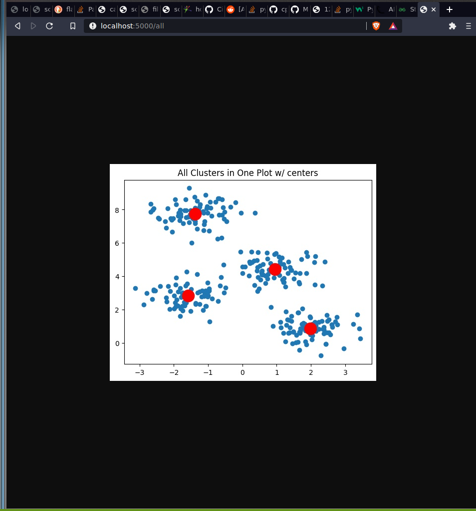
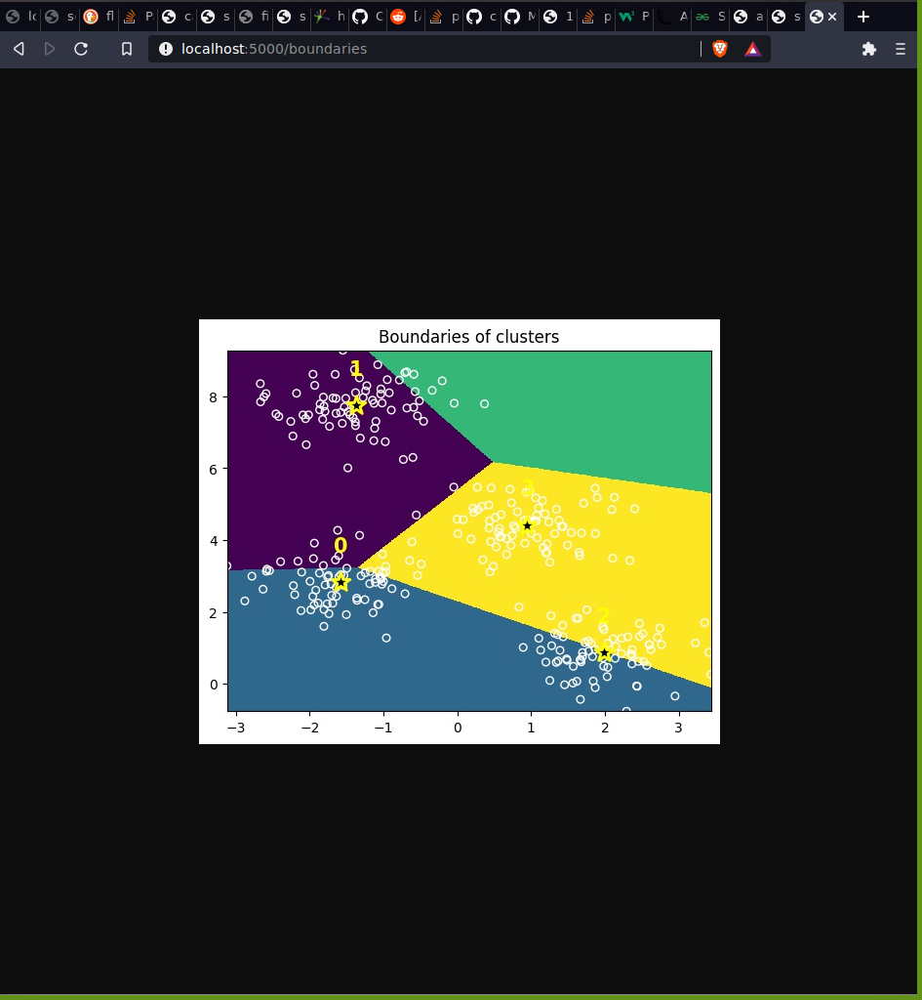
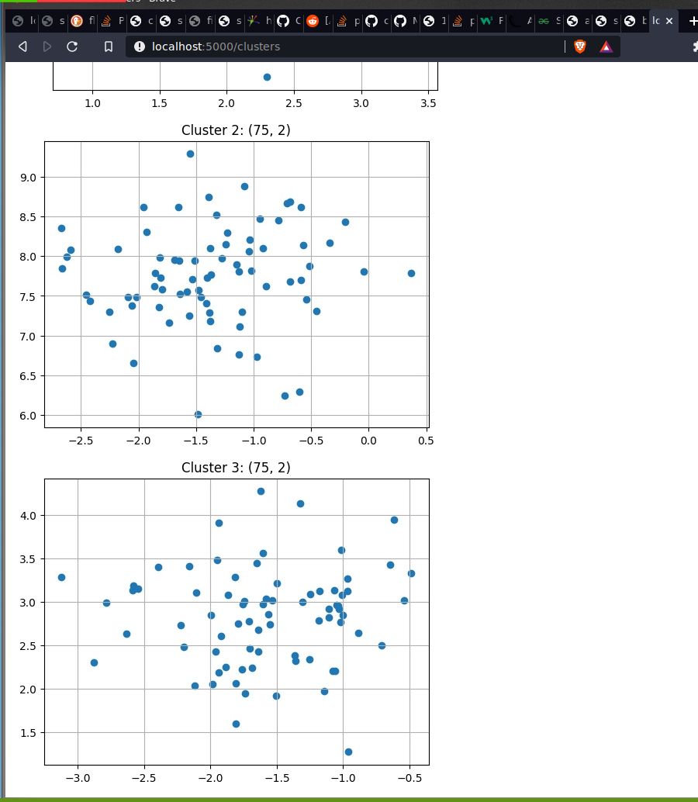
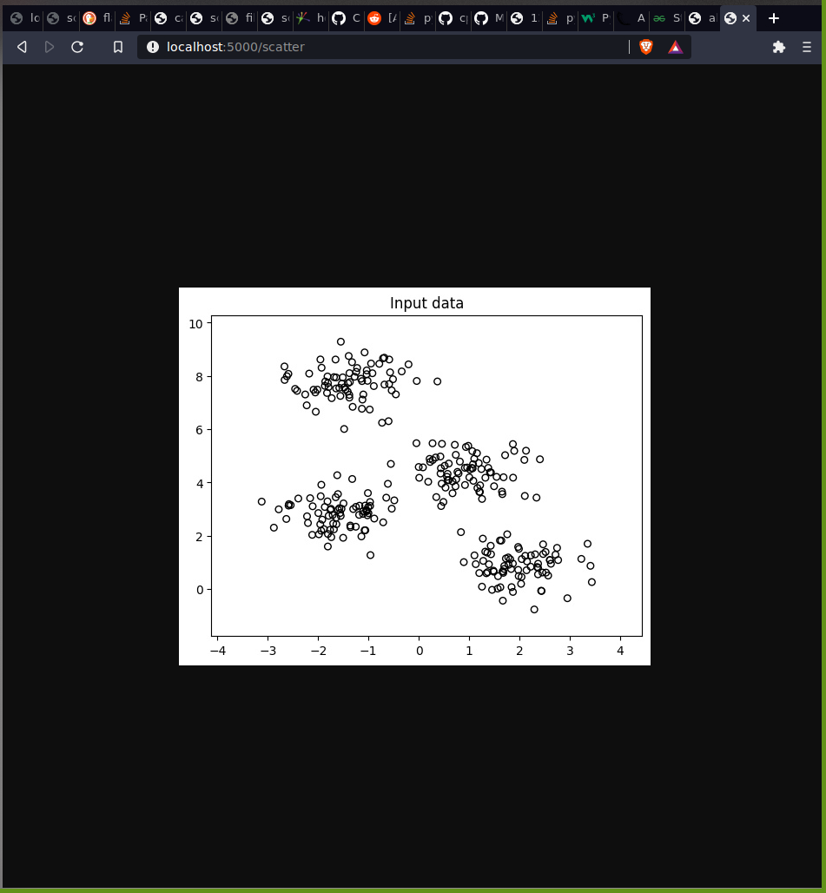

<h1>Assignment</h1>

localhost:5000/all

localhost:5000/boundaries

localhost:5000/clusters

localhost:5000/elbow

localhost:5000/scatter

### What is the difference between k-means and mean shift?

The Mean shift algorithm is an centroid-based algorithm. This means that the goal of Mean shift is to find the center points of the data and in turn reveals the clusters.

K-means on the other hand works by trying to group the data into k clusters, where the nears data is assigned to the closest “mean”. 

Another thing that's different between k-means and mean shift, is that k-means needs to know how many groups there are in the data before it can start when in Mean shift can just start without.

### In which occasions would you prefer to use the Mean shift algorithm?
 
We would prefer to use Mean shift, when it’s not obvious from the data how many groups the data have. 
